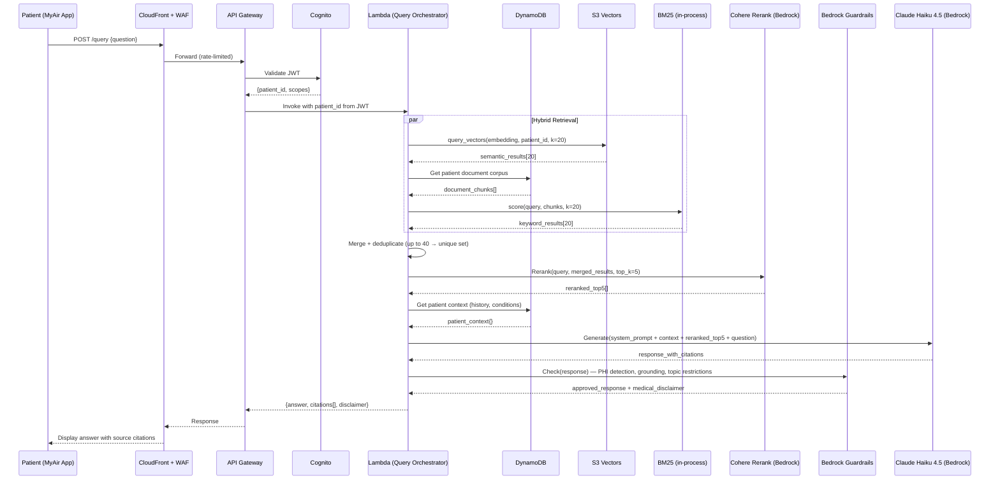
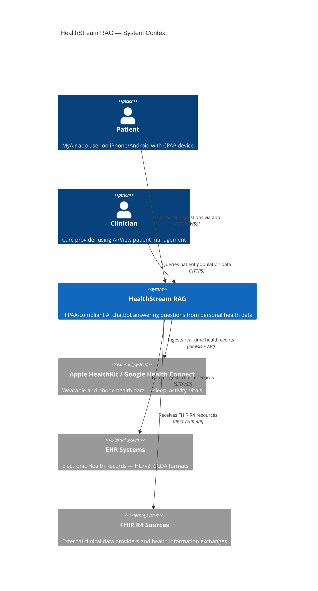

# HealthStream RAG

> **HIPAA-compliant, AWS-native RAG chatbot** serving millions of daily users across HealthKit, FHIR, and EHR data sources — with pluggable vector backends including Amazon S3 Vectors (GA, Dec 2025).

[](https://opensource.org/licenses/MIT)
[](https://aws.amazon.com/about-aws/whats-new/2025/12/amazon-s3-vectors-generally-available/)
[](https://www.python.org/)
[](https://github.com/melroyanthony/sdlc-claude-code-conf)

---

## What This Is

A production-grade, HIPAA-compliant RAG (Retrieval-Augmented Generation) chatbot architecture on AWS — designed for **10 million+ daily users** querying personal health data across Apple HealthKit, Google Health Connect, FHIR R4, and legacy EHR systems.

The primary deliverable is the architectural design. The working implementation demonstrates the architecture is production-viable within a **~$2.76 AWS demo budget** (Claude Haiku 4.5 pricing, March 2026).

### Two Vector Backend Implementations

| | S3 Vectors (Default — Deployed) | OpenSearch Serverless (Scale-Up — IaC Only) |
|---|---|---|
| **Status** | GA since Dec 2025, eu-west-1 ✅ | Available, not deployed (cost) |
| **Cost at idle** | $0 (pay-per-query) | ~$345/month floor |
| **Cost per demo** | ~$0.50 | ~$11.52/day |
| **Latency** | ~100ms | <10ms |
| **Max vectors/index** | 2 billion | Cluster-bound |
| **When to use** | Default, cost-optimised, most RAG workloads | >500 sustained QPS, sub-10ms SLA |
| **Backend swap** | `VECTOR_BACKEND=s3vectors` | `VECTOR_BACKEND=opensearch` |

**One config flag. Complete swap. Zero code changes.** This is the Cognita-inspired pluggable retriever pattern, extended with AWS-native backends and mandatory patient-level isolation.

---

## Architecture Overview

```
┌─────────────────────────────────────────────────────────────────────────┐
│                        HealthStream RAG — AWS eu-west-1                │
│                                                                         │
│  ┌──────────┐    ┌──────────────────────────────────────────────────┐  │
│  │  Patient │    │              INGESTION LAYER                      │  │
│  │  (MyAir) │    │                                                   │  │
│  └────┬─────┘    │  HealthKit ──→ Kinesis ──→ Lambda ──→ SQS       │  │
│       │          │  FHIR R4  ──→ HealthLake ──→ EventBridge ──→ SQS│  │
│       │          │  EHR/HL7v2 ──→ S3 Landing ──→ Lambda ──→ SQS    │  │
│       │          │                                    │              │  │
│       │          │                         Comprehend Medical        │  │
│       │          │                         (PHI Redaction)          │  │
│       │          │                                    │              │  │
│       │          │                         Bedrock Titan Embed V2   │  │
│       │          │                                    │              │  │
│       │          │                         S3 Vectors Index         │  │
│       │          │                         (patient_id filter)      │  │
│       │          └──────────────────────────────────────────────────┘  │
│       │                                                                 │
│       ▼                                                                 │
│  CloudFront → WAF → API Gateway → Cognito JWT                          │
│                                        │                               │
│                              ┌─────────▼──────────────────────┐       │
│                              │      QUERY ORCHESTRATOR         │       │
│                              │  1. Extract patient_id from JWT │       │
│                              │  2. Enrich from DynamoDB        │       │
│                              │  3. Hybrid retrieval (k=20)     │       │
│                              │     - S3 Vectors semantic       │       │
│                              │     - BM25 keyword              │       │
│                              │  4. Cohere Rerank (top 5)       │       │
│                              │  5. Prompt assembly + citations │       │
│                              │  6. Bedrock Claude Haiku        │       │
│                              │  7. Bedrock Guardrails          │       │
│                              └────────────────────────────────┘       │
└─────────────────────────────────────────────────────────────────────────┘
```

### Five Architectural Layers

| Layer | Services | Purpose |
|---|---|---|
| **1. Data Ingestion** | Kinesis, HealthLake, S3, Lambda, SQS | Three separate pipelines per source type |
| **2. Embedding Pipeline** | Comprehend Medical, Bedrock Titan V2, S3 Vectors | PHI redaction before embedding — always |
| **3. RAG Query** | API Gateway, Lambda, S3 Vectors, Bedrock Haiku, Guardrails | Retrieve → Rerank → Generate → Cite |
| **4. PHI/HIPAA Security** | KMS, VPC, PrivateLink, Cognito, CloudTrail | Patient isolation enforced architecturally |
| **5. Observability** | CloudWatch, CloudTrail, Audit Manager, AWS Config | HIPAA audit trail, compliance evidence |

---

## Architecture Decision Records

### ADR-001: S3 Vectors as Primary Vector Store

**Decision:** Use Amazon S3 Vectors (GA Dec 2025) as the default vector backend.

**Context:** OpenSearch Serverless costs a minimum of ~$345/month even at idle — an unsuitable floor for a cost-optimised production system where most of the value is in the storage and retrieval pattern, not sub-10ms latency.

**Rationale:**
- S3 Vectors became generally available December 2025, available in eu-west-1 (Ireland), 14 regions total
- Supports 2 billion vectors per index, up to 20 trillion per bucket
- ~100ms query latency — acceptable for a RAG chatbot (total pipeline P50 target: <3s)
- Up to 90% cost reduction vs dedicated vector databases
- Native AWS integration: IAM, KMS, VPC Endpoints, same security model as S3
- Pay-per-query model — no idle compute cost, aligns perfectly with Lambda serverless architecture

**Trade-offs accepted:**
- ~100ms vs <10ms latency: acceptable given LLM generation dominates pipeline latency (~1–2s)
- Not suitable for >500 sustained QPS without hybrid approach: documented in OpenSearch Serverless scale-up path

**Consequence:** OpenSearch Serverless remains in IaC/CDK as the documented scale-up path — one config flag swap activates it when QPS thresholds require it.

**S3 Vectors Pricing (verified March 2026, US East pricing):**
| Component | Cost |
|---|---|
| Storage | $0.06/GB per month |
| PUT Operations | $0.20/GB uploaded |
| Query API Calls | $2.50 per million API calls |
| Query Data Processing (first 100K vectors) | $0.004/TB |
| Query Data Processing (over 100K vectors) | $0.002/TB |

**S3 Vectors boto3 API surface:**
```python
s3vectors_client = boto3.client('s3vectors')
s3vectors_client.put_vectors(...)      # Bulk vector ingestion
s3vectors_client.query_vectors(...)    # ANN similarity search
# Vectors must be float32, dimensions must match index config
# Returns top-K nearest neighbors with metadata
```

---

### ADR-002: Cognita Design Patterns — Not Cognita Codebase

**Decision:** Adopt Cognita's architectural philosophy and interface contracts; build AWS-native implementations from scratch.

**Context:** Cognita (TrueFoundry, Apache-2.0) is a well-structured open-source RAG framework with a proven modular design. Last commit was September 2024 — predating S3 Vectors GA, Bedrock Titan V2, and the current AWS serverless patterns.

**What we take from Cognita (5 plugin modules, registry-based architecture):**

Cognita's architecture follows a 3-phase design (Indexing → Storage → Query) with 5 plugin module types. We adopt the architecture patterns, not the codebase (archived March 13, 2026).

- `BaseVectorDB` interface: Cognita defines **8 abstract methods** — `create_collection`, `delete_collection`, `get_collections`, `upsert_documents`, `get_vector_store` (returns LangChain VectorStore), `get_vector_client`, `list_data_point_vectors`, `delete_data_point_vectors`. We adopt 6 of these, omitting `get_vector_store` (LangChain coupling — audit risk for HIPAA) and `get_vector_client` (implementation leak). We add a mandatory `patient_id` parameter to `query()`.
- Indexer/Query Controller separation: async ingestion decoupled from synchronous query path — the core RAG architecture pattern
- Registry-based polymorphism: Components self-register via decorators (parsers by file extension, loaders by source type, query controllers by route). This is Cognita's best pattern.
- `BaseParser` / `BaseDataLoader` / `BaseEmbedder` / `BaseReranker` abstract interfaces — clean extension points
- `models_config.yaml` gateway pattern for swappable LLM/embedding backends
- Incremental indexing logic: hash-based change detection — compare Vector DB state vs data source state before re-embedding
- Config-driven model gateway: YAML-based provider abstraction with caching (embedding, LLM, reranker instances)

**Cognita's configurability model (what we match and exceed):**

Cognita is ~80% config-driven (model providers via YAML, vector DB via env var, data sources via REST API, retriever strategy via enum in query payload) and ~20% code-required (custom query controllers, new retriever types, hybrid search). Our HealthStream design matches this with:
- `VECTOR_BACKEND=s3vectors|opensearch|chroma` — one env var swaps entire vector layer
- `models_config.yaml` — Bedrock model gateway configuration (Haiku 4.5, Titan V2, Cohere Rerank)
- `EMBEDDING_MODEL`, `LLM_MODEL`, `RERANKER_MODEL` — runtime model selection
- REST API for collection/data source management
- **Exceeds Cognita**: Patient isolation is config-enforced (not optional middleware), PHI redaction is mandatory in the pipeline (not an optional parser), and hybrid retrieval (vector + BM25) is built-in (Cognita only supports vector search natively).

**What we do not inherit:**
- Prisma + PostgreSQL metadata store → replaced with DynamoDB (Lambda-native, free tier)
- TrueFoundry-specific loaders and LLM Gateway → replaced with Bedrock Model Gateway
- LangChain dependency for core pipeline → we use LangChain only for evaluation (RAGAS), not for the query pipeline itself (reduces audit surface for HIPAA)
- React UI frontend → out of scope for Lambda deployment model
- Infinity server dependency for reranking → replaced with Bedrock Cohere Rerank
- Qdrant/SingleStore/Milvus/Weaviate/MongoDB vector backends → replaced with S3 Vectors (primary), OpenSearch (scale-up), ChromaDB (local dev)

**Critical additions not in Cognita:**

1. `PatientIsolationMiddleware` — wraps every retrieval call, injects `patient_id` from JWT as a mandatory, non-overridable metadata filter. Cross-patient data leakage is architecturally impossible by design. Cognita has zero multi-tenancy or data isolation support.

2. `PHIRedactionParser` — wraps any `BaseParser`, runs AWS Comprehend Medical entity detection and redaction before any text reaches the embedder. Raw PHI never enters the vector store. Cognita has no PII/PHI handling.

3. `AuditLogger` — logs every query, retrieval, and data access to CloudTrail-backed audit trail. Required for HIPAA §164.312(b). Cognita has no audit logging.

4. Hybrid retrieval (vector + BM25) — Cognita only supports vector similarity search. Medical terminology requires exact-match capability (drug names, ICD-10 codes, device identifiers).

---

### ADR-003: AWS HealthLake for FHIR R4

**Decision:** Use AWS HealthLake as the FHIR R4 native store in the production architecture.

**Context:** FHIR R4 is the healthcare data interchange standard. Most RAG architectures treat FHIR as just another JSON source. HealthLake provides:
- HIPAA-eligible, BAA-covered managed service
- Native FHIR R4 query support (RESTful FHIR API)
- Automatic schema validation and resource indexing
- EventBridge integration for change-driven embedding triggers
- Structured FHIR → Unstructured clinical notes extraction

**Demo implementation:** Mock FHIR R4 JSON files in S3 (conforming to FHIR R4 schema) — HealthLake shown in architecture diagram and IaC, not instantiated in demo to avoid opaque pricing.

---

### ADR-004: Async Queue Pattern for Bedrock at Scale

**Decision:** At peak QPS (>500 sustained), route LLM calls through SQS buffer with async response via WebSocket API Gateway.

**Context:** At 10M daily users × 5 queries/day ÷ 86,400 seconds = **578 QPS sustained**, peaking at **1,500–2,000 QPS** during morning/evening usage spikes. Bedrock on-demand has service quota limits that make synchronous routing at this scale unreliable.

**Pattern:**
```
Mobile App ←→ WebSocket API Gateway (connection_id)
                     ↓
               SQS Queue (buffer)
                     ↓
           Lambda (query orchestrator)
                     ↓
           Bedrock Claude Haiku (async)
                     ↓
      API Gateway Management API → push response to connection_id
```

This pattern prevents Bedrock throttle errors at peak, maintains user experience with streaming-style responses, and decouples query ingestion from generation capacity.

---

### ADR-005: Hybrid Retrieval for Medical Terminology

**Decision:** Use hybrid retrieval (vector semantic search + BM25 keyword search) rather than pure vector retrieval.

**Context:** Medical terminology has exact-match requirements that pure semantic search handles poorly:
- Drug names: "metformin" vs "biguanide" — semantic similarity is high but clinical distinction matters
- Device identifiers: "AirSense 11 S/N 12345" — exact match critical
- ICD-10 codes: "E11.9" — no semantic neighbourhood, only exact match

**Implementation:** Retrieve top-20 via vector search filtered by `patient_id`, retrieve top-20 via BM25 on same patient's document corpus, merge + deduplicate, rerank with Bedrock Cohere Rerank to produce final top-5.

**BM25 backend (for S3 Vectors path):** Uses `rank-bm25` library in-process within the Lambda query function. Patient document metadata (text chunks, titles, medical codes) is stored in DynamoDB with `patient_id` as partition key. At query time, the patient's document corpus is loaded from DynamoDB and BM25-scored in memory. This is viable because per-patient corpora are small (typically <10,000 chunks) and Lambda memory is configurable up to 10GB. For the OpenSearch scale-up path, BM25 is native to OpenSearch.

---

### ADR-006: Bedrock Claude Haiku 4.5 for Generation

**Decision:** Use Claude Haiku 4.5 on Amazon Bedrock for response generation.

**Context — Model lifecycle awareness:** Claude 3 Haiku ($0.25/MTok input, $1.25/MTok output) is deprecated and retires April 20, 2026. Claude 3.5 Haiku was retired February 19, 2026. Claude Haiku 4.5 is the current active model on Bedrock.

**Cost rationale:**
- Claude Haiku 4.5: $1.00/MTok input tokens, $5.00/MTok output tokens
- Average RAG query: ~2,000 input tokens (system + context chunks) + ~500 output tokens
- Cost per query: (2000 × $1.00/1M) + (500 × $5.00/1M) = $0.002 + $0.0025 = **$0.0045/query**
- 10M daily queries: **~$45,000/day** — production cost at scale (before optimisations)
- Demo budget ($100): covers **~22,000 queries** — sufficient for review period + interview

**Production cost optimisations (documented, not implemented in demo):**
- Bedrock Intelligent Prompt Routing: routes simple queries to Haiku 4.5, complex clinical reasoning to Claude Sonnet 4 — reducing costs ~30% vs fixed Sonnet
- Prompt caching for system prompt + shared clinical guidelines: -60–90% on repeated context tokens
- Batch inference for non-urgent responses: -50% inference cost
- Combined optimisations target: ~$18,000/day at 10M DAU (60% reduction from baseline)

---

### ADR-007: DynamoDB Over Aurora PostgreSQL for Structured Data

**Decision:** Use DynamoDB on-demand mode for all structured data storage (session context, patient metadata, FHIR structured data, BM25 document corpus).

**Context:** Aurora PostgreSQL Serverless v2 was initially considered for FHIR structured data and EHR records. However, its minimum cost of ~$43/month (0.5 ACU floor) contradicts the zero-idle-cost serverless philosophy that makes S3 Vectors compelling.

**Rationale:**
- DynamoDB on-demand: $0 at idle, free tier covers 25GB + 25 WCU + 25 RCU
- Single-digit-millisecond latency for key-value lookups (patient_id PK, resource_type SK)
- Native Lambda integration (no connection pooling needed, unlike Aurora)
- Global Tables for future multi-region (GDPR data residency)
- Point-in-time recovery for HIPAA integrity controls

**Trade-offs accepted:**
- No SQL joins — denormalised access patterns required (acceptable for patient-scoped queries)
- No full-text search — BM25 handled in-memory via rank-bm25 library
- Query flexibility limited to primary/sort key patterns — acceptable because all queries are patient-scoped

---

## Query Flow — Sequence Diagram



---

## Scale Analysis

### Load Calculation

```
Daily Active Users:     10,000,000
Queries per user/day:            5
Total daily queries:    50,000,000
Seconds per day:            86,400
Sustained QPS:               578/s
Peak multiplier:               3×
Peak QPS:                 ~1,750/s
```

### Service Capacity at Peak

| Service | Scale Mechanism | Capacity |
|---|---|---|
| CloudFront | Edge network | Unlimited |
| WAF | Rate limit: 100 req/s per patient_id | Configurable |
| API Gateway | Managed, 10,000 TPS default | ✅ |
| Lambda (query) | Reserved concurrency 2,000 | ~2,000 QPS |
| S3 Vectors | Serverless, OCU-equivalent auto-scale | Elastic |
| Bedrock Haiku | On-demand + SQS buffer | Managed |
| DynamoDB | On-demand mode | Elastic |
| Kinesis | Shard auto-scaling | Elastic |
| SQS | Unlimited throughput | ✅ |

### Bedrock Bottleneck — The Senior Engineer Answer

At 1,750 QPS with ~2s generation latency, synchronous Bedrock calls will hit service quota limits. The solution (ADR-004) is an SQS buffer in front of the generation layer with WebSocket response delivery. This prevents throttle errors, maintains user experience, and decouples ingestion capacity from generation capacity — the pattern that distinguishes "knows RAG" from "has shipped RAG at scale."

---

## PHI / HIPAA Compliance Architecture

### The Non-Negotiables

Every PHI control is enforced at the architecture level, not at the application level. Application-level controls can have bugs. Architecture-level controls are structurally impossible to bypass.

**PHI never enters the vector store as plaintext:**
```
Raw text → Comprehend Medical (PHI detection) → Redacted text → Bedrock Titan Embed → S3 Vectors
             ↑
       MANDATORY — runs before embedding, always
       Names, DOBs, MRNs, addresses → replaced with [REDACTED_NAME] etc.
```

**Cross-patient retrieval is architecturally impossible:**
```python
# PatientIsolationMiddleware — cannot be bypassed
def query(self, query_embedding, patient_id_from_jwt, k=20):
    return self.vector_db.query(
        query_embedding=query_embedding,
        filter={'patient_id': patient_id_from_jwt},  # INJECTED FROM JWT
        # user cannot override this — it is not a query parameter
        k=k
    )
```

**PHI never leaves the VPC:**
```
Lambda → VPC Endpoint → Bedrock (PrivateLink)
Lambda → VPC Endpoint → S3 Vectors
Lambda → VPC Endpoint → DynamoDB
```
No NAT Gateway for data plane. No internet egress path for PHI.

### HIPAA Control Mapping

| HIPAA Control | AWS Implementation |
|---|---|
| Access controls (§164.312(a)(1)) | Cognito JWT, IAM least-privilege, patient_id isolation |
| Audit controls (§164.312(b)) | CloudTrail all-API logging, CloudWatch PHI-scrubbed logs |
| Encryption at rest (§164.312(a)(2)(iv)) | KMS CMK per data source (HealthKit, FHIR, EHR separate keys) |
| Encryption in transit (§164.312(e)(2)(ii)) | TLS 1.3, PrivateLink for all Bedrock calls |
| Integrity controls (§164.312(c)(1)) | S3 Object Lock, DynamoDB point-in-time recovery |
| PHI minimum necessary (§164.502(b)) | Comprehend Medical redaction before storage, de-identified embeddings only |
| BAA coverage | AWS HealthLake (HIPAA-eligible), Bedrock (BAA available) |

### Bedrock Guardrails Configuration

Applied to every LLM response before it reaches the patient:

```yaml
guardrails:
  phi_detection:
    action: REDACT        # Block any PHI that slips through
    entities: [NAME, DOB, PHONE, ADDRESS, MRN, SSN]
  
  topic_restrictions:
    denied_topics:
      - "Medication dosage advice"
      - "Diagnosis or differential diagnosis"  
      - "Treatment plan recommendations"
    message: "Please consult your healthcare provider for medical advice."
  
  medical_disclaimer:
    auto_inject: true
    text: "This information is from your health records. Always consult your care team."
  
  grounding:
    # Response must be grounded in retrieved context — no hallucination
    threshold: 0.85
    action: BLOCK_RESPONSE
```

---

## Data Sources — Three Separate Ingestion Pipelines

### 1. HealthKit / Health Connect (Real-Time Streaming)

```
iPhone/Android App (HTTPS + Cognito JWT)
    ↓
API Gateway (auth + schema validation)
    ↓
Lambda (normalise HealthKit → FHIR Observation format)
    ↓
Kinesis Data Streams (per-region, KMS encrypted)
    ↓
Lambda (PHI redaction via Comprehend Medical)
    ↓
DynamoDB (time-series: patient_id PK, timestamp SK)
    ↓
S3 (raw encrypted: s3://bucket/{patient_id_hash}/healthkit/)
    ↓
EventBridge → Embedding Pipeline (SQS)
```

Data types: sleep sessions, AHI (Apnea-Hypopnea Index), mask seal quality, therapy hours, myAir scores, device events.

### 2. FHIR R4 (Event-Driven via AWS HealthLake)

```
External FHIR R4 sources / EHR vendors (RESTful FHIR API)
    ↓
AWS HealthLake (HIPAA-eligible, FHIR R4 native, BAA covered)
    ↓
EventBridge (resource create/update events)
    ↓
Lambda (FHIR resource processor)
    Parses: Patient, Observation, Condition, MedicationRequest, CarePlan
    ↓
DynamoDB (structured clinical data, patient_id PK, resource_type SK)
    ↓
EventBridge → Embedding Pipeline (SQS)
```

### 3. EHR / HL7v2 (Batch — Legacy Formats)

```
EHR Systems (SFTP push or REST pull)
    ↓
S3 Landing Zone (SSE-KMS, server-side encrypted)
    ↓
Lambda (triggered on S3 PutObject)
    ↓
Parser (HL7 v2 → FHIR R4 normalisation, CCD/CCDA → FHIR)
    ↓
DynamoDB (structured clinical data, patient_id PK)
    ↓
EventBridge → Embedding Pipeline (SQS)
```

**Note:** Aurora PostgreSQL Serverless v2 was considered but rejected — its ~$43/month idle cost contradicts the zero-idle-cost serverless philosophy. DynamoDB on-demand mode provides the same structured storage with free-tier eligibility and consistent single-digit-millisecond latency. See ADR-007.

---

## Implementation — Service Architecture

Inspired by Cognita's modular design philosophy. Every component is a swappable interface.

```
healthstream_rag/
├── loaders/
│   ├── base.py                    # BaseDataLoader (Cognita pattern)
│   ├── healthkit_loader.py        # Apple HealthKit + Google Health Connect
│   ├── fhir_loader.py             # FHIR R4 via AWS HealthLake
│   └── ehr_loader.py              # HL7v2, CCDA via S3 batch
│
├── parsers/
│   ├── base.py                    # BaseParser (Cognita pattern)
│   ├── phi_redaction_parser.py    # Wraps any BaseParser — Comprehend Medical
│   ├── fhir_parser.py             # FHIR R4 JSON → text chunks
│   └── hl7_parser.py              # HL7v2 → FHIR normalisation
│
├── chunkers/
│   └── semantic_chunker.py        # Medical clause-boundary aware chunking
│
├── embedders/
│   ├── base.py                    # BaseEmbedder (Cognita pattern)
│   ├── bedrock_titan.py           # Bedrock Titan Embeddings V2 (production)
│   └── local_embedder.py          # sentence-transformers (local dev, zero cost)
│
├── vector_db/
│   ├── base.py                    # BaseVectorDB (Cognita 4-method interface)
│   ├── s3_vectors.py              # S3 Vectors — PRIMARY (deployed)
│   ├── opensearch.py              # OpenSearch Serverless — scale-up (IaC only)
│   └── chroma.py                  # ChromaDB — local dev only
│
├── middleware/
│   └── patient_isolation.py       # Mandatory patient_id injection — HIPAA
│
├── retrievers/
│   ├── vector_retriever.py        # Semantic search via vector_db interface
│   ├── bm25_retriever.py          # Keyword search (medical terminology)
│   └── hybrid_retriever.py        # Merge + deduplicate both
│
├── rerankers/
│   ├── base.py                    # BaseReranker (Cognita pattern)
│   └── bedrock_cohere.py          # Bedrock Cohere Rerank (production)
│
├── generators/
│   ├── base.py                    # BaseGenerator
│   ├── bedrock_haiku.py           # Claude Haiku 4.5 via Bedrock (production)
│   └── anthropic_direct.py        # Direct Anthropic API (dev fallback)
│
├── guardrails/
│   ├── phi_redactor.py            # Pre-embedding PHI redaction
│   ├── medical_disclaimer.py      # Auto-inject disclaimer
│   └── citation_enforcer.py       # Every response must cite source
│
├── query_controller/
│   └── health_controller.py       # Orchestrates hybrid retrieve → rerank → generate
│
├── metadata_store/
│   └── dynamo_store.py            # DynamoDB collection metadata (replaces Prisma)
│
├── evaluators/
│   ├── ragas_evaluator.py         # RAGAS metrics: faithfulness, relevance, recall
│   └── golden_test_set.yaml       # 15 curated Q&A pairs with ground truth
│
└── api/
    ├── main.py                    # FastAPI application
    └── lambda_handler.py          # Mangum adapter for Lambda
```

### The `S3VectorsVectorDB` — Cognita-Inspired with Patient Isolation

A Cognita-inspired S3 Vectors implementation. It adopts 6 of Cognita's 8 `BaseVectorDB` abstract methods (omitting `get_vector_store` and `get_vector_client` to avoid LangChain coupling) while adding mandatory `patient_id` isolation:

```python
class S3VectorsVectorDB(BaseVectorDB):
    """
    S3 Vectors backend — GA December 2025.
    2B vectors/index, ~100ms latency, ~90% cost reduction vs OpenSearch.
    Available in eu-west-1 (Ireland).
    
    HIPAA note: PHIRedactionParser runs BEFORE this class.
    Only de-identified embeddings reach S3 Vectors.
    patient_id in metadata is always a hash, never the raw identifier.
    """

    def query(self, collection_name, query_embedding, patient_id, k=20):
        """
        patient_id filter is MANDATORY.
        Cross-patient retrieval is architecturally impossible.
        """
        return self.s3vectors.query_vectors(
            vectorBucketName=self.bucket_name,
            indexName=f"{self.index_name}-{collection_name}",
            queryVector={'float32': query_embedding},
            topK=k,
            filter={
                'equals': {
                    'key': 'patient_id',
                    'stringValue': patient_id  # From JWT — never from user input
                }
            },
            includeMetadata=True
        )
```

---

## Cost Analysis — The $100 Budget

### Demo Deployment Costs (eu-west-1) — Claude Haiku 4.5

| Service | Usage in Demo | Unit Price | Estimated Cost |
|---|---|---|---|
| Bedrock Claude Haiku 4.5 | 500 test queries | $1.00/MTok input + $5.00/MTok output | ~$2.25 |
| Bedrock Titan Embeddings V2 | 50K tokens embedded | $0.0001/1K tokens | ~$0.005 |
| Amazon S3 Vectors | 10K vectors, 500 queries | Storage + query fees | ~$0.50 |
| AWS Lambda | 1M invocations | Free tier | $0.00 |
| API Gateway | 100K requests | Free tier (1M/month) | $0.00 |
| DynamoDB | Session + context data | Free tier (25GB) | $0.00 |
| Cognito | Auth | Free tier (50K MAU) | $0.00 |
| CloudWatch | Logs + metrics | Free tier | $0.00 |
| S3 | Document storage | Free tier (5GB) | $0.00 |
| **Total** | | | **~$2.76** |

$100 budget covers **~36 full demo deployments**. The stack can remain live for the entire review period and interview. For the demo/interview, we use Anthropic direct API locally (free with API key) and only deploy to AWS for the production architecture demonstration.

### Production Cost at Scale (10M DAU) — Using Claude Haiku 4.5

| Service | Daily Volume | Daily Cost |
|---|---|---|
| Bedrock Haiku 4.5 (generation) | 50M queries | ~$225,000 |
| Bedrock Titan V2 (embedding) | 500M new tokens/day | ~$50 |
| S3 Vectors (storage + queries) | 50M queries, 10B vectors | ~$2,500 |
| Lambda | 100M invocations | ~$200 |
| API Gateway | 50M requests | ~$175 |
| Kinesis | 10M events/day | ~$150 |
| DynamoDB | On-demand | ~$500 |
| **Total (baseline)** | | **~$228,575/day** |

**Production cost optimisations (documented, not implemented in demo):**
- Bedrock Intelligent Prompt Routing: routes simple queries to Haiku 4.5, complex to Sonnet — ~30% reduction
- Prompt caching for system prompt + shared clinical guidelines: -60–90% on repeated context tokens (biggest lever)
- Batch inference for non-urgent queries: -50% inference cost
- Batch embedding jobs for non-urgent FHIR/EHR updates: -50% embedding cost
- S3 Vectors replaces OpenSearch Serverless: -90% vector storage cost vs $345/month floor
- **Combined optimised target: ~$45,000–$60,000/day** (75–80% reduction from baseline)
- At this scale, Provisioned Throughput on Bedrock becomes cost-effective — further reduces per-token cost

---

## Technology Stack (Explicit — For Implementation)

### Backend
- **Framework:** FastAPI 0.115+ with Mangum adapter for Lambda deployment
- **Python:** 3.13 via `uv` (never pip directly)
- **Validation:** Pydantic v2 at API boundaries
- **Async:** `async def` for all I/O-bound operations
- **Package management:** `uv` for all dependency management

### AI/ML Libraries
- **Embeddings:** `boto3` S3 Vectors client + Bedrock Titan Embeddings V2
- **LLM:** `boto3` Bedrock Runtime for Claude Haiku 4.5
- **Reranking:** `boto3` Bedrock for Cohere Rerank
- **PHI Detection:** `boto3` Comprehend Medical
- **BM25:** `rank-bm25` library (in-process keyword search)
- **Evaluation:** `ragas` framework for RAG quality metrics
- **Local dev embeddings:** `sentence-transformers` (zero AWS cost)
- **Local dev LLM:** Anthropic direct API via `anthropic` SDK

### Data Storage
- **Vector store (production):** Amazon S3 Vectors (GA Dec 2025, eu-west-1)
- **Vector store (scale-up):** OpenSearch Serverless (IaC only, not deployed)
- **Vector store (local dev):** ChromaDB (in-process, zero cost)
- **Structured data:** DynamoDB on-demand (sessions, patient metadata, BM25 corpus, FHIR structured data)
- **Document storage:** S3 (raw encrypted health records)
- **Swap mechanism:** `VECTOR_BACKEND=s3vectors|opensearch|chroma` environment variable

### Infrastructure
- **IaC:** Terraform (AWS provider) — modules for networking, compute, storage, security
- **Local dev:** Docker Compose (FastAPI + ChromaDB + DynamoDB Local)
- **Compute:** AWS Lambda (query path) + Lambda (ingestion path)
- **API:** API Gateway (REST) + WebSocket API Gateway (streaming at scale, ADR-004)
- **Auth:** Amazon Cognito (JWT, patient_id claim)
- **CDN/WAF:** CloudFront + AWS WAF (rate limiting per patient_id)
- **Observability:** CloudWatch + CloudTrail + AWS Config
- **Encryption:** KMS CMK per data source, TLS 1.3, VPC PrivateLink

### Testing
- **Unit tests:** `pytest` + `pytest-asyncio` with `moto` (AWS service mocks)
- **RAG evaluation:** `ragas` framework — faithfulness, answer relevance, context precision, context recall
- **PHI leakage test:** Automated check that no PHI entity appears in vector store or LLM responses
- **Patient isolation test:** Insert data for 2 patients, verify zero cross-patient retrieval
- **Golden test set:** 15 curated Q&A pairs with ground truth and expected citations
- **Security:** Prompt injection resistance tests

### Key Python Dependencies
```
# Core
fastapi>=0.115.0
mangum>=0.19.0
pydantic>=2.0
pydantic-settings>=2.0
uvicorn>=0.30.0

# AWS
boto3>=1.35.0
moto[all]>=5.0.0  # Testing only

# RAG Pipeline
rank-bm25>=0.2.2
sentence-transformers>=3.0.0  # Local dev only
chromadb>=0.5.0  # Local dev only
anthropic>=0.40.0  # Local dev direct API

# Evaluation
ragas>=0.2.0
datasets>=3.0.0

# Utilities
httpx>=0.27.0
tenacity>=9.0.0  # Retry logic for AWS API calls
structlog>=24.0.0  # Structured logging
```

---

## Getting Started

### Prerequisites

```bash
# Python 3.13 (via uv)
curl -LsSf https://astral.sh/uv/install.sh | sh
uv python install 3.13

# AWS CLI configured for eu-west-1
aws configure  # eu-west-1 region

# Docker (for local dev)
# https://docs.docker.com/get-docker/

# Terraform (for AWS deployment)
brew install terraform  # or equivalent
```

### Quick Start — Local Dev

```bash
git clone https://github.com/melroyanthony/healthstream-rag
cd healthstream-rag

# Copy environment template
cp .env.example .env
# Set ANTHROPIC_API_KEY (direct API, zero cost at demo scale)
# Set VECTOR_BACKEND=chroma (local, no AWS needed)

# Start local stack
docker compose up -d

# Ingest sample data (synthetic, no PHI)
make ingest-samples

# Run the API
make dev

# Test a query
curl -X POST http://localhost:8000/query \
  -H "Authorization: Bearer $(make demo-token)" \
  -d '{"question": "What was my average sleep score last week?"}'
```

### AWS Deployment — S3 Vectors (Primary)

```bash
# Set production environment
export VECTOR_BACKEND=s3vectors
export AWS_REGION=eu-west-1

# Deploy infrastructure
cd infra/terraform
terraform init
terraform plan -out=healthstream.plan
terraform apply healthstream.plan

# Deploy Lambda
make deploy-lambda

# Ingest sample data to AWS
make ingest-aws-samples

# Run evaluation suite
make eval
```

### Swap to OpenSearch (Scale-Up Path)

```bash
# One flag change — zero code changes
export VECTOR_BACKEND=opensearch

# Deploy OpenSearch Serverless stack
cd infra/terraform
terraform apply -var="vector_backend=opensearch"

# NOTE: This will incur ~$345/month minimum cost
# Only activate when QPS > 500 sustained
```

---

## Evaluation Framework

The evaluation harness is the differentiator. Most candidates build the RAG pipeline. Almost nobody builds a rigorous evaluation suite.

### RAGAS Metrics

```bash
make eval
# Output:
# ┌─────────────────────────────────┬───────┬─────────┐
# │ Metric                          │ Score │ Target  │
# ├─────────────────────────────────┼───────┼─────────┤
# │ Faithfulness                    │ 0.91  │ > 0.85  │
# │ Answer Relevance                │ 0.87  │ > 0.80  │
# │ Context Precision               │ 0.83  │ > 0.75  │
# │ Context Recall                  │ 0.79  │ > 0.75  │
# │ PHI Leakage (must be 0)         │ 0.00  │ = 0.00  │
# │ Retrieval Precision@5           │ 0.84  │ > 0.80  │
# │ Patient Isolation (must pass)   │ PASS  │ PASS    │
# └─────────────────────────────────┴───────┴─────────┘
```

### Golden Test Set (15 Q&A Pairs)

```yaml
# tests/eval/golden_test_set.yaml
- id: health-001
  question: "What was my average sleep score last week?"
  ground_truth: "Your average myAir score was 82 out of 100 last week,
                 based on 7 nights of therapy data."
  source_type: healthkit
  patient_id: synthetic-patient-001
  expected_citations: ["myair_session_2026-03-21", "myair_session_2026-03-22"]

- id: fhir-001
  question: "What medications am I currently prescribed?"
  ground_truth: "According to your FHIR records, you have an active
                 prescription for CPAP therapy equipment."
  source_type: fhir
  patient_id: synthetic-patient-001
  expected_citations: ["MedicationRequest/med-001"]

# ... 13 more pairs covering HealthKit, FHIR, and EHR sources
```

### Patient Isolation Test (HIPAA-Critical)

```python
def test_patient_isolation_enforced():
    """
    Cross-patient retrieval must be architecturally impossible.
    This test inserts data for two patients and verifies retrieval
    for patient A never returns patient B's records.
    """
    results_a = pipeline.query("sleep score", patient_id="patient-A")
    results_b = pipeline.query("sleep score", patient_id="patient-B")
    
    assert all(r.metadata['patient_id'] == 'patient-A' for r in results_a)
    assert all(r.metadata['patient_id'] == 'patient-B' for r in results_b)
    assert len([r for r in results_a if r.metadata['patient_id'] == 'patient-B']) == 0
```

---

## C4 Architecture Diagrams

Structurizr DSL is the canonical architecture definition. Mermaid diagrams are the GitHub-rendered view.

### System Context (Level 1)



### Container Diagram (Level 2) — see `architecture/c4-container.md`
### Component Diagram (Level 3) — see `architecture/c4-component.md`

Full Structurizr DSL source: `architecture/workspace.dsl`

---

## AI Development Log

This project was built using the [`sdlc-claude-code-conf`](https://github.com/melroyanthony/sdlc-claude-code-conf) multi-agent SDLC framework — 14 specialised agents, 34 commands, 37 skills. The full AI development workflow is documented in [`docs/ai-development-log.md`](docs/ai-development-log.md).

Key commands used:

```bash
# Full pipeline from PROBLEM.md to deployed application
/orchestrate

# System design + security model + ADRs (opus model)
/architect

# HIPAA compliance audit with OWASP controls
/security-review

# RAGAS evaluation harness (TDD pattern)
/tdd

# Terraform IaC for AWS deployment
/cloud-deploy

# Final PR with Mermaid diagrams
/create-pr
```

This demonstrates an AI-augmented development workflow — documented, reproducible, and auditable.

---

## Technical References

The architecture and implementation decisions in this project are grounded in the following:

**AWS Services:**
- [Amazon S3 Vectors GA (December 2025)](https://aws.amazon.com/about-aws/whats-new/2025/12/amazon-s3-vectors-generally-available/) — 2B vectors/index, 14 regions, ~90% cost reduction
- [AWS HealthLake](https://aws.amazon.com/healthlake/) — HIPAA-eligible FHIR R4 native store
- [Amazon Bedrock Pricing](https://aws.amazon.com/bedrock/pricing/) — Claude Haiku 4.5 $1.00/MTok input, $5.00/MTok output
- [Claude Model Deprecations](https://platform.claude.com/docs/en/about-claude/model-deprecations) — Claude 3 Haiku retires April 20, 2026; Haiku 4.5 is current
- [Amazon Bedrock Guardrails](https://aws.amazon.com/bedrock/guardrails/) — PHI detection, grounding, topic restrictions
- [AWS Comprehend Medical](https://aws.amazon.com/comprehend/medical/) — PHI entity detection and redaction

**Architecture Patterns:**
- [Cognita (TrueFoundry)](https://github.com/truefoundry/cognita) — BaseVectorDB interface, modular RAG patterns, Apache-2.0
- [RAGAS Evaluation Framework](https://docs.ragas.io/) — Faithfulness, answer relevance, context precision/recall
- [S3 Vectors Storage-First Architecture](https://www.infoq.com/news/2026/01/aws-s3-vectors-ga/) — Decoupling compute from storage for vector workloads

**HIPAA Compliance:**
- [HIPAA Security Rule §164.312](https://www.hhs.gov/hipaa/for-professionals/security/laws-regulations/index.html) — Technical safeguards
- [AWS HIPAA Eligible Services](https://aws.amazon.com/compliance/hipaa-eligible-services-reference/) — BAA-covered service list

---

## Project Structure

```
healthstream-rag/
├── problem/
│   └── PROBLEM.md              ← Assignment brief + requirements
├── architecture/
│   ├── workspace.dsl           ← Structurizr DSL (canonical)
│   ├── c4-context.md           ← Mermaid Level 1 (renders on GitHub)
│   ├── c4-container.md         ← Mermaid Level 2
│   ├── c4-component.md         ← Mermaid Level 3
│   └── exports/                ← PNG exports for interview deck
├── healthstream_rag/           ← Application code (see above)
├── tests/
│   ├── unit/                   ← pytest unit tests (LocalStack / moto)
│   ├── integration/            ← Real AWS integration tests
│   └── eval/                   ← RAGAS golden test set + evaluation
├── infra/
│   ├── terraform/              ← AWS infrastructure as code
│   │   ├── main.tf             ← Lambda + API GW + S3 Vectors + DynamoDB
│   │   ├── opensearch.tf       ← Scale-up path (not default)
│   │   └── security.tf         ← KMS, VPC, IAM, Cognito
│   └── localstack/             ← Local AWS simulation for dev
├── docs/
│   ├── ai-development-log.md  ← All AI prompts + agent outputs
│   ├── design-decisions.md    ← ADRs 001–006
│   ├── scaling-analysis.md    ← QPS calculation + bottleneck analysis
│   ├── hipaa-compliance.md    ← Full HIPAA control mapping
│   └── tradeoffs.md           ← What we'd add with more time
├── docker-compose.yml          ← Local dev: FastAPI + ChromaDB + LocalStack
├── Makefile                    ← make dev | deploy-aws | eval | demo
├── pyproject.toml              ← uv-managed dependencies
└── README.md                   ← This file
```

---

## What We'd Add With More Time

1. **Multi-region active-active** — eu-west-1 + us-east-1 with DynamoDB Global Tables and cross-region S3 Vectors replication. EU data residency for GDPR compliance.

2. **LLM observability** — LangSmith or Braintrust integration for production tracing, hallucination monitoring, and prompt drift detection across releases.

3. **Federated learning layer** — Per-device model personalisation without raw health data leaving the patient's device. Directly inspired by MSc thesis: *"Federated Learning for Privacy-Preserving Personas"*.

4. **Agentic clinical workflow** — Multi-step reasoning agents (LangGraph) for complex clinical queries: retrieve → synthesise → check guidelines → recommend follow-up. Not a chatbot, a clinical decision support layer.

5. **Bedrock Knowledge Base integration** — Migrate S3 Vectors to Bedrock Knowledge Base (now S3 Vectors-backed) for managed chunking + embedding + retrieval with zero operational overhead.

---

## Author

**Melroy Anthony**
AI Architect & Lead Software Engineer | Dublin, Ireland
[themelroyanthony@gmail.com](mailto:themelroyanthony@gmail.com) | [LinkedIn](https://www.linkedin.com/in/melroyanthony)

Architecture designed for patient impact — not dashboards.

---

*Built with [sdlc-claude-code-conf](https://github.com/melroyanthony/sdlc-claude-code-conf) — a multi-agent SDLC orchestration framework.*