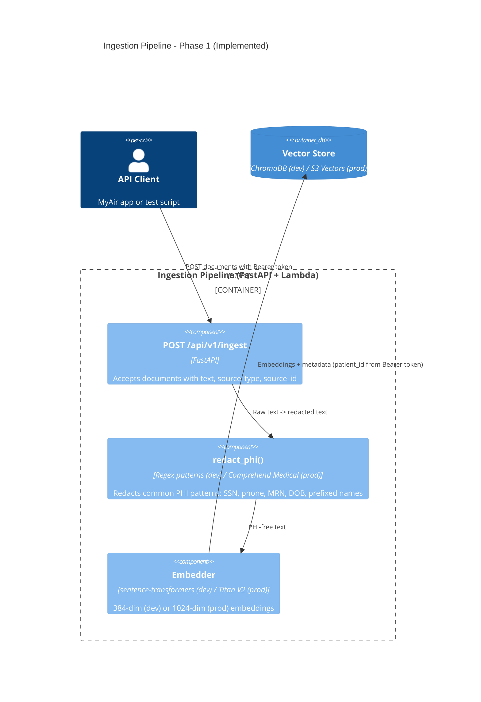

# C4 Level 3: Component Diagram - Ingestion Pipeline

> How does health data flow from sources to the vector store?

## Phase 1 (Implemented)

Single generic ingestion endpoint with PHI redaction and embedding.



## Phase 2 (Target Architecture)

Dedicated loaders per data source with event-driven ingestion.


## HIPAA Data Flow Guarantee (Both Phases)

```
Raw text with PHI
    |
    v
redact_phi()
    Phase 1: Regex patterns (local dev) / Comprehend Medical (when EMBEDDER_BACKEND=bedrock)
    Phase 2: Always Comprehend Medical
    - Names -> [REDACTED_NAME]
    - DOBs -> [REDACTED_DOB]
    - MRNs -> [REDACTED_MRN]
    - SSNs -> [REDACTED_SSN]
    |
    v
ONLY redacted text reaches:
    - Embedder
    - Vector Store
    - BM25 Corpus

Raw PHI stored ONLY in:
    - S3 (SSE-KMS encrypted, VPC-only access)
    - HealthLake (HIPAA BAA-covered) [Phase 2]
```
