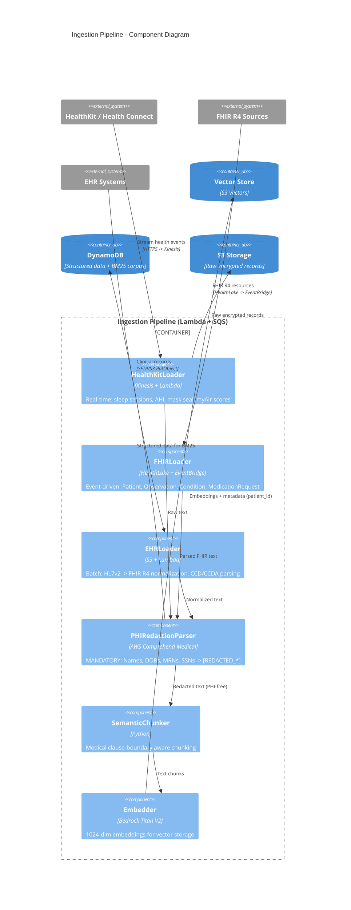

# C4 Level 3: Component Diagram - Ingestion Pipeline

> How does health data flow from sources to the vector store?



## HIPAA Data Flow Guarantee

```
Raw text with PHI
    |
    v
PHIRedactionParser (Comprehend Medical)
    - Names -> [REDACTED_NAME]
    - DOBs -> [REDACTED_DOB]
    - MRNs -> [REDACTED_MRN]
    - SSNs -> [REDACTED_SSN]
    |
    v
ONLY redacted text reaches:
    - SemanticChunker
    - Embedder
    - Vector Store
    - BM25 Corpus (DynamoDB)

Raw PHI stored ONLY in:
    - S3 (SSE-KMS encrypted, VPC-only access)
    - HealthLake (HIPAA BAA-covered)
```
