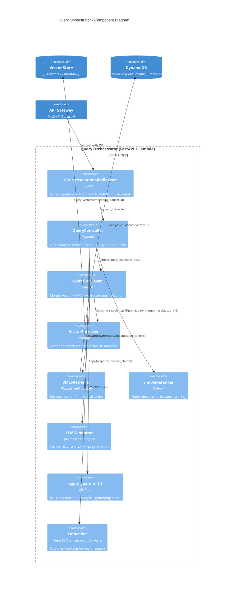

# C4 Level 3: Component Diagram - Query Orchestrator

> How does the RAG query pipeline work internally?



## Pipeline Flow

```
1. JWT -> PatientIsolationMiddleware -> extract patient_id
2. QueryController.query(question, patient_id)
   2a. Embed query via Titan V2 / sentence-transformers
   2b. HybridRetriever.retrieve()
       - VectorRetriever: semantic top-20 (patient_id filtered)
       - BM25Retriever: keyword top-20 (patient_id filtered)
       - Normalize scores (min-max to 0..1)
       - Merge + deduplicate by source_id
   2c. Reranker: score top-5 by query relevance
   2d. Generator: Claude Haiku 4.5 with [source_id] citations
   2e. Guardrails: PHI redaction, denied topics, grounding check
3. Return {answer, citations[], disclaimer, metadata}
```
