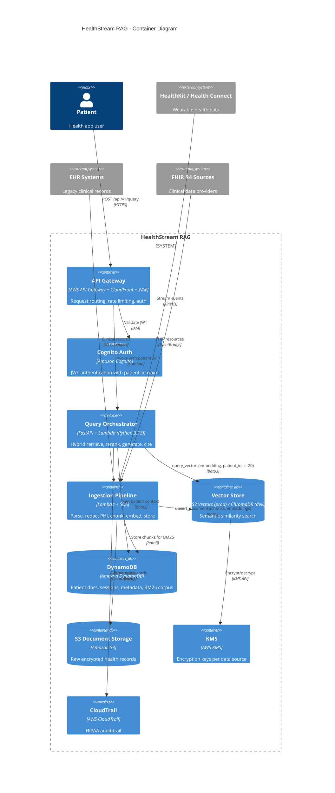

# C4 Level 2: Container Diagram

> What are the major building blocks of HealthStream RAG?

## Container Responsibilities

| Container | Responsibility | Scale Mechanism |
|-----------|---------------|-----------------|
| API Gateway | Auth, rate limit, routing | Managed, 10K TPS |
| Query Orchestrator | RAG pipeline execution | Lambda reserved concurrency 2,000 |
| Ingestion Pipeline | Parse, redact, embed, store | SQS + Lambda auto-scale |
| Vector Store | Semantic search | S3 Vectors: elastic, pay-per-query |
| DynamoDB | Structured data + BM25 corpus | On-demand, single-digit ms |
| S3 Storage | Raw encrypted records | Unlimited |
