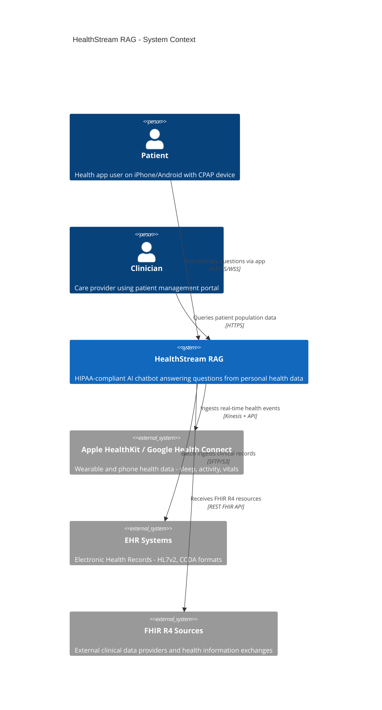

# C4 Level 1: System Context

> Who uses HealthStream RAG and what external systems does it interact with?

## Key Decisions

- **Patients** interact via a mobile health app (e.g. companion CPAP app)
- **Clinicians** access via a patient management portal
- **Three data source types** each with a dedicated ingestion pipeline
- All interactions go through HIPAA controls (encryption, audit, patient isolation)
