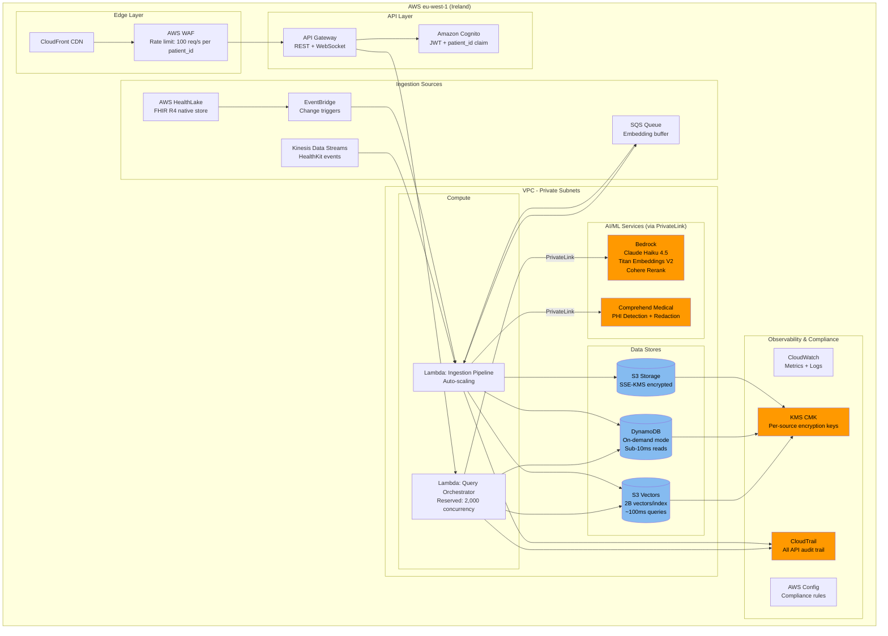

# C4 Deployment Diagram

> How is HealthStream RAG deployed on AWS?

## Key Deployment Decisions

| Decision | Rationale |
|----------|-----------|
| **eu-west-1 (Ireland)** | S3 Vectors GA, GDPR-friendly, low latency for EU users |
| **VPC + PrivateLink** | PHI never leaves the VPC via public internet |
| **Lambda (not ECS)** | Zero idle cost, per-query pricing matches S3 Vectors model |
| **No NAT Gateway** | Data plane uses VPC Endpoints only, no internet egress for PHI |
| **KMS CMK per source** | HealthKit, FHIR, EHR data encrypted with separate keys |
