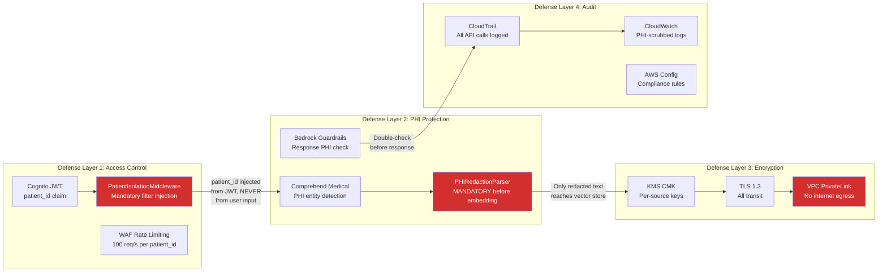

# HIPAA Security Controls Architecture

> How does HealthStream RAG enforce HIPAA compliance at the architecture level?



## HIPAA Control Mapping

| HIPAA Control | Implementation | Enforcement Level |
|---|---|---|
| Access controls (164.312(a)(1)) | Cognito JWT + PatientIsolationMiddleware | **Architectural** - cannot bypass |
| Audit controls (164.312(b)) | CloudTrail all-API logging | **Automatic** - all calls logged |
| Encryption at rest (164.312(a)(2)(iv)) | KMS CMK per data source | **Automatic** - S3/DynamoDB default |
| Encryption in transit (164.312(e)(2)(ii)) | TLS 1.3 + PrivateLink | **Architectural** - no plaintext path |
| Integrity controls (164.312(c)(1)) | S3 Object Lock, DynamoDB PITR | **Automatic** - immutable + recoverable |
| PHI minimum necessary (164.502(b)) | Comprehend Medical redaction | **Mandatory** - runs before embedding |
| BAA coverage | HealthLake, Bedrock (BAA available) | **Contractual** |

## The "Architecturally Impossible" Guarantee

Patient isolation is enforced at three levels:

1. **JWT extraction**: `patient_id` comes from Cognito token, never from request body
2. **Middleware injection**: `PatientIsolationMiddleware` injects `patient_id` into every query - no code path bypasses it
3. **Vector store filter**: S3 Vectors / ChromaDB filter on `patient_id` metadata - cross-patient results are physically impossible

```python
# This is the entire isolation mechanism:
def get_patient_id(authorization: str = Header(...)) -> str:
    # patient_id comes from JWT, NEVER from request body
    token = decode_jwt(authorization)
    return token.patient_id  # Injected via Depends()

# Every vector query includes this mandatory filter:
vector_db.query(
    query_embedding=embedding,
    patient_id=patient_id_from_jwt,  # Cannot be overridden
    top_k=20
)
```
